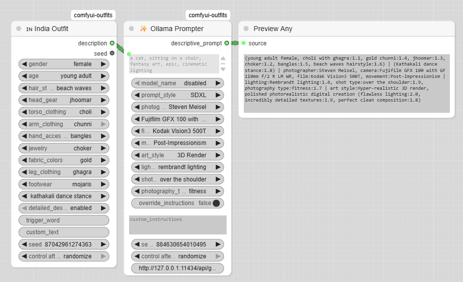

# ComfyUI Ethnic Outfits Custom Nodes

Custom ComfyUI nodes for generating outfit prompts representing diverse ethnicities, cultures, and regions. Uses extensible JSON data for clothing, accessories, and poses, with “random/disabled” dropdowns for flexibility. Advanced prompt engineering is supported via Ollama LLM integration. Easily add new regions, ethnicities, or cultures by updating data files and creating lightweight node wrappers. Designed for artists, researchers, and developers seeking culturally rich, customizable prompt generation in ComfyUI workflows.

## Features
- Unified codebase for multiple regions, ethnicities, and cultures
- Shared, extensible JSON data for clothing, accessories, and poses
- Consistent dropdown options (with "random" and "disabled" support)
- Easily add new regions, ethnicities, cultures, or customize logic
- Advanced prompt engineering for SDXL/Flux/LLM nodes

## Supported Regions
- Example: India 🇮🇳, Indonesia 🇮🇩, Japan 🇯🇵 (add your own!)

## Directory Structure
```
custom_nodes/comfyui-outfits/
  ├── data/
  │     ├── common/
  │     ├── styles/
  │     ├── prompts/
  │     ├── in/
  │     ├── id/
  │     ├── jp/
  │     └── ...
  ├── nodes/
  │     ├── ethnic_outfit_common.py
  │     ├── in_node.py
  │     ├── id_node.py
  │     ├── jp_node.py
  │     ├── ollama_prompter.py
  │     └── ...
  ├── __init__.py
  ├── README.md
  └── ...
```

## Installation (Custom Node)

1. Download or clone this repository:
   ```sh
   git clone https://github.com/manifestations/comfyui-outfits.git
   ```
2. Copy or move the `comfyui-outfits` folder into your ComfyUI `custom_nodes` directory. For example:
   - On Windows: `C:\Users\<yourname>\ComfyUI\custom_nodes\comfyui-outfits`
   - On Linux/macOS: `~/ComfyUI/custom_nodes/comfyui-outfits`
3. Restart ComfyUI.
4. The new nodes will appear in the ComfyUI node list under "🌀WizDroid/PromptGen".

## Usage
- Use the "Ethnic Outfit Generator" nodes in your workflow.

## Adding New Regions
1. Add new data files under `data/<region_code>/`.
2. Create a lightweight node wrapper (e.g., `xx_node.py`) using the shared class.
3. Register the node in `__init__.py`.

## Ollama Prompter & LLM Integration

This extension includes an Ollama Prompter node for advanced prompt engineering with SDXL, Flux, and LLMs.

### Ollama Installation
1. Visit [Ollama's official site](https://ollama.com/download) and download the installer for your OS.
2. Follow the installation instructions for your platform (Windows, macOS, Linux).
3. Start the Ollama server:
   - On Windows: Run `ollama serve` in Command Prompt or PowerShell.
   - On macOS/Linux: Run `ollama serve` in Terminal.

### Llama 3.2 Model Installation
1. After installing Ollama, pull the Llama 3.2 model:
   ```sh
   ollama pull llama3:latest
   ```
   (Replace `llama3:latest` with the specific tag if needed.)
2. Verify the model is available:
   ```sh
   ollama list
   ```
3. The Ollama Prompter node will now be able to use Llama 3.2 for prompt enhancement.

### Using the Ollama Prompter Node
- Add the "Ollama Prompter" node to your ComfyUI workflow.
- Configure the prompt and model options as needed.
- Ensure the Ollama server is running and the desired model is available.

For more details, see the [Ollama documentation](https://ollama.com/docs) and [Llama 3.2 model info](https://ollama.com/library/llama3).

## Example Workflow

Below is a screenshot of a sample ComfyUI workflow using these nodes:



## License
See [LICENSE](LICENSE) for details.

---

## Acknowledgements

Special thanks to [dagthomas](https://github.com/dagthomas) and [rikkar69](https://github.com/rikkar69) for their inspiring work in the ComfyUI and generative AI community.

Big thanks to [GitHub Copilot](https://github.com/features/copilot) for AI-powered coding assistance.

Contributions and feedback welcome!
